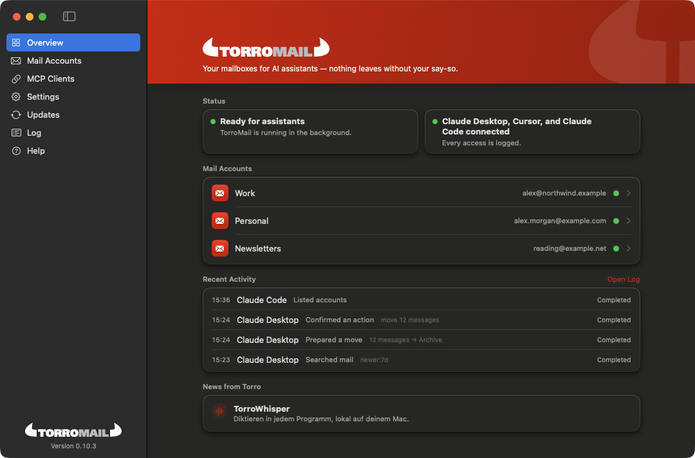
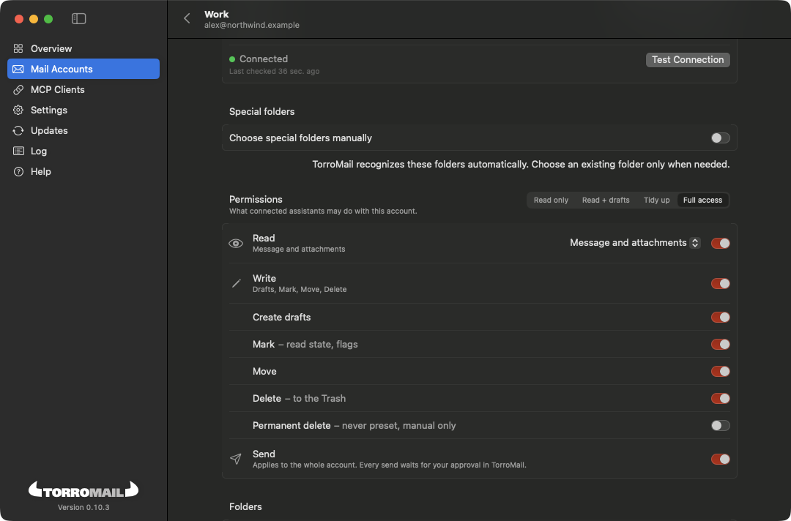
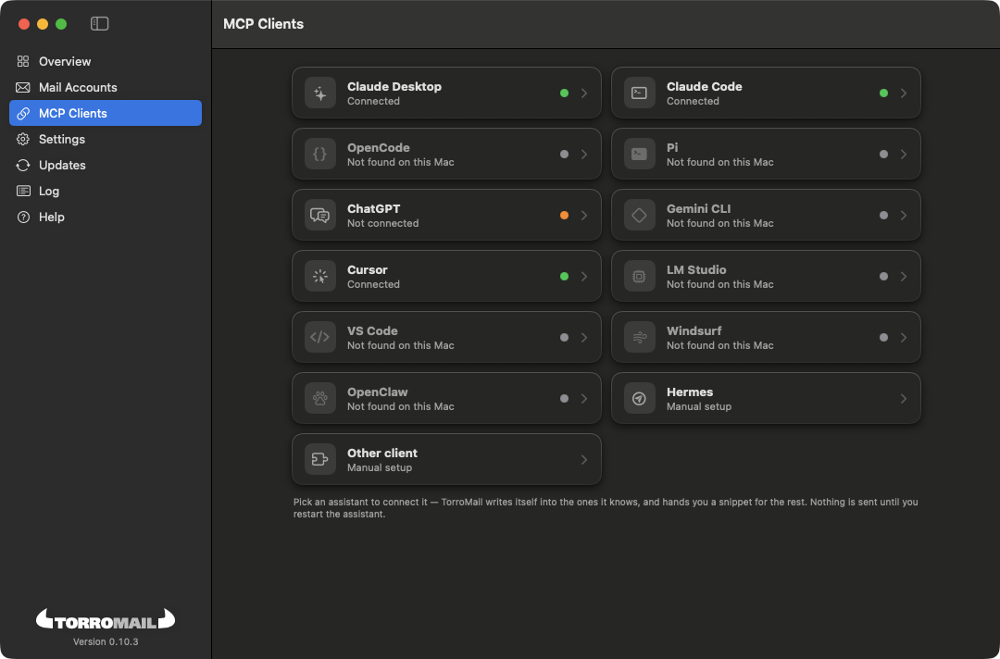
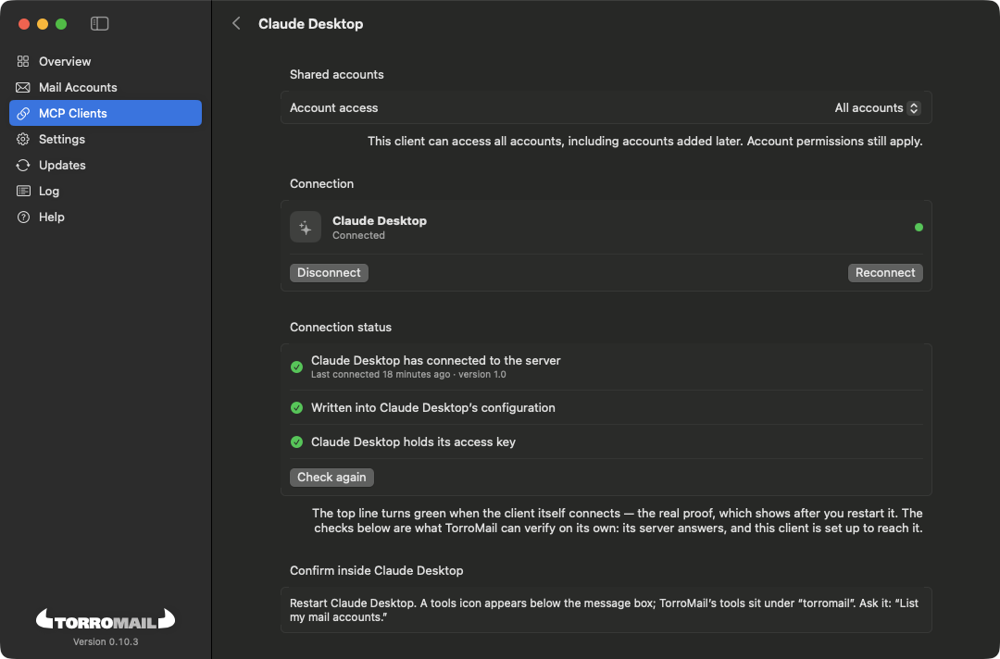
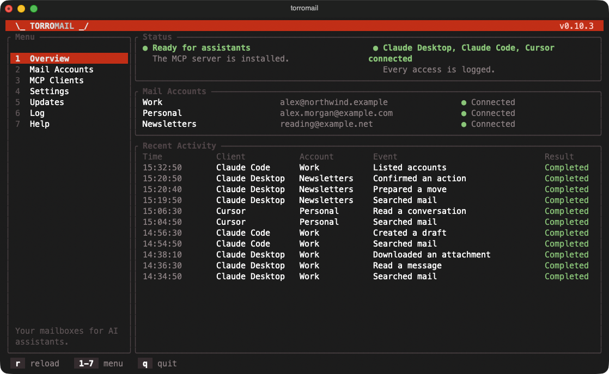
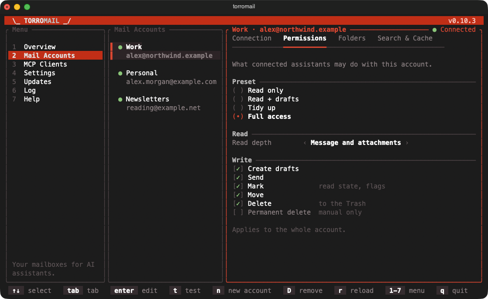
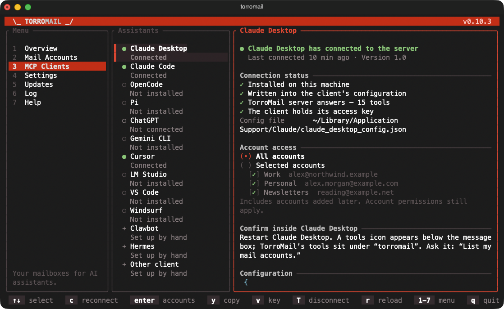

# TorroMail — MCP server for your email

[](https://github.com/mahype/TorroMail/actions/workflows/ci.yml)
[](https://github.com/mahype/TorroMail/releases/latest)
[](https://github.com/mahype/TorroMail/releases)
[](#license)
[](https://github.com/mahype/TorroMail/releases/latest)
[](https://modelcontextprotocol.io)
[](Cargo.toml)
[](apps/TorroMailApp)

**Set up in an app, not in JSON files.** A native macOS app (and a terminal UI for Linux
and Windows) connects your IMAP accounts to Claude, ChatGPT, Cursor and other AI
assistants — with per-account permissions, your approval before anything is sent, moved
or deleted, and everything running locally.

<p align="center">
  
</p>

TorroMail is a local mail access layer for agents. It retrieves mail from configured
accounts and exposes mail capabilities through an MCP server. The project is
open-source and open-interface-first: the MCP contract and local safety model are
the primary product surface.

TorroMail is not a general-purpose mail client. It does not provide an inbox UI
for users to browse, read, or manage mail manually. Any native macOS app in this
repository is a configuration and control surface for account setup, permissions,
MCP lifecycle, pending action review, diagnostics, and local status.

The project deliberately keeps account setup, secrets, OAuth, and permission
changes out of MCP tools. MCP clients can search, read within policy, prepare
risky actions, and inspect read-only admin state. The native app owns
configuration and user confirmation.

## Screenshots

Both surfaces do the same job — accounts, permissions, connected assistants, the
log — and neither shows your mail. The data below is a demo setup.

### macOS app

| Permissions per account | Connected assistants |
| --- | --- |
|  |  |

<details>
<summary>Client detail</summary>



</details>

### Terminal (`torromail`) — macOS, Linux, Windows



| Permissions per account | Connected assistants |
| --- | --- |
|  |  |

## Product Boundaries

- Build the mail retrieval, policy, cache, and MCP interface first.
- Keep human-facing mail consumption out of scope: no inbox timeline, message
  reader, thread browser, or day-to-day mail workflow UI.
- Use the native app only for setup, consent, permissions, status, and
  diagnostics.
- Treat MCP tools as the supported interface for agents and integrations.
- Favor clear documentation and explicit contracts over hidden behavior.

## Layout

- `crates/torromail-core`: portable Rust domain model for accounts, policies, cache defaults, pending actions, and reusable search result sets.
- `crates/torromail-mcp`: explicit MCP tool surface and stdio line server facade.
- `crates/torromail-control`: the configuration model every surface shares — accounts and their state file, the policy document writer, MCP client setup, provider discovery, log readers, platform paths.
- `crates/torromail-discovery`: the network half of account discovery — a small DNS client (MX, TXT, SRV), HTTPS autoconfig fetches and a TCP probe — behind the `Network` trait `torromail-control` decides with.
- `crates/torromail-tui`: terminal control surface (`torromail`) for macOS, Linux and Windows — the counterpart to the macOS app, and on Linux and Windows the only one: add accounts, set permissions, connect assistants, read the log. This is not a mail client UI either.
- `crates/torromail-keychain`: the macOS keychain with the app's team-scoped access lists, so the app, the server and the terminal surface share secrets without a dialog. The one crate allowed `unsafe`, confined to its `sys` module.
- `contracts`: behaviour pinned as shared cases. The Rust tests and the Swift contract suite run the same files, so the two implementations cannot drift apart silently.
- `apps/TorroMailApp`: macOS SwiftUI configuration/control app. This is not a mail client UI.
- `docs`: architecture notes and product decisions.

## Agent Orientation

Start with `AGENTS.md` before changing the project. It summarizes the current
product intent, boundaries, architecture, and verification commands for agentic
workers.

## Verify

```sh
cargo test
cargo build -p torromail-mcp
swift run --package-path apps/TorroMailApp --scratch-path apps/TorroMailApp/.build TorroMailKitContract
swift build --package-path apps/TorroMailApp --scratch-path apps/TorroMailApp/.build
```

On Linux, `scripts/install-linux.sh` builds a release and installs `torromail` and
`torromail-mcp` into `~/.local/bin` (no root; `--uninstall` removes them again).
On a Mac, `scripts/install-macos.sh` does the same and signs the copies with your
development identity — without that signature they could not share keychain items with
the app.

On Windows (experimental) the same two programs keep their data in
`%LOCALAPPDATA%\TorroMail` and passwords in the Credential Manager; the background check is
not available there yet.

Prebuilt terminal programs are part of every release: a signed and notarized universal
tarball for macOS, a zip for Windows, and for Linux tarballs for x86_64 and aarch64 and the
`torromail-bin` AUR package ([packaging/aur](packaging/aur/torromail-bin/PKGBUILD)), which
the release builds and installs in a clean Arch container before anything is published.

To try the terminal surface from a checkout: `cargo run -p torromail-tui`. It reads the shared data directory —
`~/Library/Application Support/TorroMail` on macOS, `$XDG_STATE_HOME/torromail`
(default `~/.local/state/torromail`) on Linux, and keeps secrets in the macOS keychain or
the desktop's Secret Service (`secret-tool` from libsecret must be installed). On a Mac an
unsigned `cargo run` build can store its own secrets but cannot read the app's; use
`scripts/install-macos.sh` for one that can. Keys: `1`–`7` sections, arrows to
select, `n` new account, `enter` edit, `c` connect an assistant, `q` to quit — the bottom line
always lists what applies.

In development, build `torromail-mcp` before launching the SwiftUI app if you want the app supervisor to start the MCP process automatically from `target/debug/torromail-mcp`.

For a runnable dev bundle, use `scripts/make-app-bundle.sh`.

## Releases

Pushing a `v*` tag triggers [.github/workflows/release.yml](.github/workflows/release.yml),
which builds a universal `TorroMail.app`, signs and notarizes it, packages a
`.dmg`, signs a Sparkle appcast, builds the terminal programs for macOS
(signed and notarized), Linux (with their AUR package) and Windows, and publishes everything as one GitHub Release — assembled as a draft
first, so nothing half-finished is ever the latest release. Installed Mac
copies can check that feed automatically or on demand. See
[docs/RELEASING.md](docs/RELEASING.md) for versioning rules, the required
signing secrets, and how to build a release locally.

## License

Licensed under either of [Apache License, Version 2.0](LICENSE-APACHE) or
[MIT license](LICENSE-MIT) at your option.
